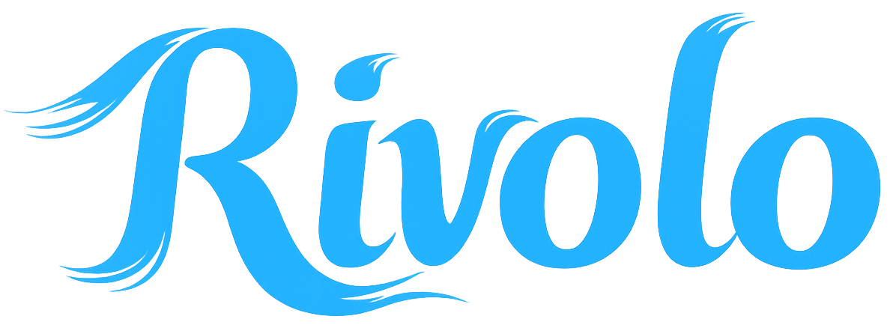

<p align="center">
  
</p>

<p align="center"><em>The no-notes notes app 💧</em></p>

Rivolo (REE-voh-loh) is the Italian word for "small stream". Every day, you write your thoughts, ideas, notes and todos without organizing anything. Whenever you need to find something complex, just ask the LLM to surface what you need.

Try it here: [rivolo.app](https://rivolo.app)

Rivolo is a local-first PWA deployed on Cloudflare Pages. Notes, settings, AI requests, and cloud file transfers normally run in the browser. Same-origin Pages Functions exchange and refresh Google Drive, Dropbox, and OneDrive OAuth credentials. For OneDrive, an authenticated Cloudflare WebSocket relay distributes day-change events and a migration registry stores source/destination identifiers; these services never receive note contents. AI prompts and relevant notes are sent only when you ask, directly to the provider you select: Gemini, Anthropic, OpenAI, or your own OpenAI-compatible endpoint. Dropbox, Google Drive, or OneDrive receives notes only if you enable that sync provider. Custom endpoints must be reachable from the device and allow Rivolo's browser origin, headers, and HTTPS connection; on a phone, `localhost` refers to the phone itself.

Hosted MCP Agent access is optional and changes that boundary: when a user enables it in Settings, Rivolo stores an encrypted provider credential and target metadata in Cloudflare D1. The authenticated MCP Worker then downloads and, for additive tools, uploads that user's configured cloud Markdown file. D1 stores credentials, profiles, tokens, and operation metadata—not the notes themselves.

> [!NOTE]
> The app was completely developed with coding agents. I use it daily. I wrote about this [here](https://diegobit.com/post/rivolo).

## MCP

Rivolo supports two MCP modes:

- **Local:** a read-only stdio server that queries a local Rivolo Markdown file. Build it with `npm run mcp:build`, then point your MCP client at `dist-mcp/mcp/index.js` with `RIVOLO_NOTES_FILE` set to the file.
- **Hosted:** a multi-user Streamable HTTP server at `https://mcp.aitlab.it/mcp`. Each user enables Agent access for their active Dropbox or Google Drive profile in Rivolo Settings. Clients authenticate with Rivolo OAuth or a personal access token created in Settings. Hosted writes are additive: append by default, with optional prepend; they never replace or delete a day.

The hosted server reads only the last cloud-synced state. It exposes the local read tools plus `add_to_day` and `add_to_today`, and uses durable `operation_id` replay protection for writes. See [the MCP guide](mcp/README.md) for tools and local client configuration, and [the OAuth notes](docs/mcp-oauth.md) for the hosted authorization design.

The local MCP server reads a single-file export, not OneDrive's daily folder. Hosted Agent access currently supports Dropbox and Google Drive only. See [MCP setup and tools](mcp/README.md).

## Run

```bash
npm install
npm run dev
```

The Vite server is sufficient unless you are testing cloud sync. To run the built app, Pages Functions and the OneDrive relay Worker together:

```bash
npm run dev:cloud
```

## Build

```bash
npm run build
npm run preview
```

## Rivolo and AIT identities

Rivolo’s core is a simple, local-first daily stream. This fork aims to support a growing team at AI Technologies while remaining comfortable for personal notes. Rivolo and AIT share the same core experience, with subtle branding differences. Identity controls presentation; collaboration comes from explicit features. Future changes should keep everyday writing easy as more coworkers participate.

Settings → Appearance → App identity switches between Rivolo and Rivolo x AIT. The choice stays on the current device and web address; it does not change notes or sync settings. The company domain, `rivolo.aitlab.it`, defaults to AIT, while `rivolo.app` defaults to Rivolo.

For the company deployment, set `VITE_APP_IDENTITY=ait` in the build environment so the initial HTML also contains the company title and installation icons. To preview that build locally:

```bash
VITE_APP_IDENTITY=ait npm run build
npm run preview
```

Choose the identity before adding the app to the home screen. Browsers may keep an already installed icon or name until the app is added again. Each identity has its own manifest and icons, with a shared app ID on the same web address. The personal and company domains have separate browser storage.

The company brain in `public/ait-brain.svg` comes from the supplied AI Technologies SVG, with the lettering removed. The white-and-blue stream icons in `public/icons/ait-*.png` were created with the builtin imagegen tool from Rivolo's existing icon using this prompt:

> Edit target: the provided existing Rivolo app icon. Create its inverse colourway for the company's companion version. Change only colours: replace the blue square background with a pure white background, and recolour the existing white winding stream shape into Rivolo's cyan blue (#22b3ff, gently deepening to #169fe6). Preserve the EXACT stream silhouette, curves, location, proportions, thin upper-left swoosh and the softly fading trailing stream layers from the original. Full-bleed square app icon, sharp clean edges, no rounded frame baked into the image, no shadows around the square, no text, no letters, no AIT badge, no brain, no additional symbols. It must be recognizably the SAME Rivolo stream icon with white and blue exchanged. Output a square high-resolution PNG suitable for 512px, 192px and 180px exports.

## Project checks

```bash
npm test -- --maxWorkers=2
npm run lint
npm run build
npm run mcp:build
npm run test:events-runtime
```

Two Vitest workers avoid CPU contention in the 10,000-day import/rollback test. The production build checks the app, Pages Functions and event Worker with TypeScript; the MCP server has its own build. The event runtime check runs Pages and the Worker locally with synthetic credentials, without contacting Microsoft.

Use the production build for service-worker/offline checks; the Vite development server does not exercise the installed PWA. Automated provider fixtures do not replace tests with real shared Microsoft accounts or an installed iOS PWA. See the [verification checklist](docs/verification.md) and the [OneDrive implementation plan and rollout checks](docs/plans/2026-10-01-onedrive-daily-sync.md).

## Cloud sync setup

This fork targets `https://rivolo.aitlab.it` in the AIT Cloudflare account. The upstream app remains at [rivolo.app](https://rivolo.app). Configure provider OAuth applications and secrets for this fork before enabling cloud sync; upstream provider registrations may not accept this fork's callback URLs.

The providers use two kinds of values:

- **Public** (client ids, allowed origins) — kept in `wrangler.toml` for `localhost`, `rivolo.aitlab.it`, and `dev.aitlab.it`. Set your own provider client IDs there.
- **Secret** (client secrets, encryption keys) — never in the repo. Put them in a local `.dev.vars` file for development, and add them as encrypted secrets in the Cloudflare Pages dashboard for production. Start from `.dev.vars.example`. Any long random string works for the encryption keys.

### Google Drive

Create a Google Cloud OAuth web client, enable the Google Drive API, and list your app's origins (`localhost` and your domain) as authorized JavaScript origins. Rivolo asks only for the `drive.file` scope and manages a single `/rivolo/inbox.md` file.

Secrets you'll need:

```bash
GOOGLE_CLIENT_SECRET=...
GOOGLE_TOKEN_ENCRYPTION_KEY=...
```

One gotcha: if the Google consent screen stays in Testing mode, sign-ins expire after seven days. Publish it before relying on sync.

### Dropbox

Create a Dropbox app with `files.content.read` and `files.content.write` access, and add your callback URLs (`https://rivolo.aitlab.it/auth/dropbox/callback` and the `localhost` equivalent). Dropbox needs no client secret — just one encryption key:

```bash
DROPBOX_TOKEN_ENCRYPTION_KEY=...
```

### OneDrive — shared notes across Microsoft accounts

OneDrive requires your own Microsoft app registration and deployment configuration; it is not enabled by adding the UI alone.

1. In Microsoft Entra **App registrations**, register an app supporting **accounts in any organizational directory and personal Microsoft accounts**.
2. Add a **Web** platform (not SPA: Rivolo exchanges codes in a Pages Function), with redirect URIs `http://localhost:8788/auth/onedrive/callback` and `https://YOUR-DOMAIN/auth/onedrive/callback`.
3. Add Microsoft Graph **delegated** permissions `User.Read` and `Files.ReadWrite.All`. Rivolo also requests `offline_access`. Shared files across accounts require access to files the signed-in user can edit; organization policies may require administrator consent.
4. Create a client secret. Set `ONEDRIVE_CLIENT_ID` and `ONEDRIVE_ALLOWED_ORIGINS` in the relevant `wrangler.toml` environment (use your actual origin). Set `ONEDRIVE_CLIENT_SECRET` and a separate random `ONEDRIVE_TOKEN_ENCRYPTION_KEY` in `.dev.vars` locally and Cloudflare Pages secrets in production. Never put secrets in frontend/Vite variables.
5. Deploy the event Worker first with `npm run deploy:events`, then deploy the app and Pages Functions through your usual Pages deployment. `wrangler.toml` binds `ONEDRIVE_EVENTS` to the external `rivolo-onedrive-events` Worker (including production). Keep both in the same Cloudflare account. The relay reuses `ONEDRIVE_TOKEN_ENCRYPTION_KEY` with a separate ticket key derivation; no additional secret is needed.
6. Locally, run `npm run dev:cloud`. It builds the app and starts Pages and the relay Worker in one Wrangler process using both configuration files. Restart an already-running Pages server after updating this command. Starting Pages alone leaves the external Durable Object unavailable: ticket connections and migration requests return 503. Plain Vite does not serve OAuth or WebSocket endpoints. `npm run dev:events` remains available for isolated Worker development.

OneDrive stores a notebook in a folder, with one Markdown file per day: `/Rivolo/2026/10/2026-10-01.md`. Google Drive and Dropbox keep their existing single-file format. Manual export still produces one portable Markdown notebook.

To share the notes:

1. On the device containing your notes, open **Settings → Cloud sync → OneDrive**, connect, use `/Rivolo` (or another folder path), and activate OneDrive.
2. In OneDrive, share that notebook **folder** with the other Microsoft accounts, granting edit access, and copy its sharing link.
3. On every device, connect the appropriate account, paste the folder link into **Shared folder link or OneDrive path**, save, and activate OneDrive. Opening the invitation in OneDrive first may be necessary for organization or guest accounts.
4. Pull the notebook and keep Rivolo open until the offline loading indicator finishes. Local edits and downloaded days remain available offline. **Force pull** replaces this device's notebook after a local rollback backup; **Force push** replaces matching days with this device's version while preserving unrelated remote days.

Only the active provider syncs. Changes upload after about seven seconds, and only dirty days are transferred. Each day has its own revision, merge baseline and author metadata. Independent edits to different Markdown lines are combined; concurrent additions are retained remote first, then local. Conflicting edits to the same existing line use the last push. Personal OneDrive upload sessions defer completion and the final commit carries a condition on the file revision. Business/SharePoint drives use conditional content uploads; Rivolo first verifies stale-update and duplicate-creation rejection using a temporary file containing no notes, then removes it. If the drive does not enforce these conditions, uploads stop. Conflicts trigger a fresh read and merge, with up to three attempts. Personal and business shared-folder behavior must also be verified on the accounts used for deployment.

The relay uses one Durable Object room per canonical drive/folder identity. Before issuing a short-lived encrypted ticket or publishing an event, Pages verifies folder access with Microsoft Graph and checks that changed files belong to its year/month/day hierarchy. Events contain day/file identifiers and revisions, never note contents or author names. The Worker stores the last revision per file to deduplicate retries. One socket serves the entire notebook; events pull only the affected day. Deletions invalidate the folder inventory. Startup, channel reconnection and returning to the foreground recover missed or external edits through a paginated inventory. There is no continuous OneDrive polling. Google Drive and Dropbox retain their three-minute checks. Closed or backgrounded PWAs do not continuously sync.

Successful uploads, baselines and pending notification metadata are checkpointed in the local database. Failed days can retry independently, and notification retries do not repeat completed uploads. Pending editor drafts and edits made during an upload remain protected. Confirmed remote deletions remove clean local days after a backup; a new local edit can recreate its own deleted day. Moved, renamed or malformed daily files block that day's synchronization instead of being interpreted as deleted notes. Revoked folder access stops sync while keeping local notes.

With OneDrive active, each day has an author icon that toggles a fixed-width gutter of initials beside the editable note, without moving or rewrapping its text. Adjacent lines by the same author are grouped without line numbers. Hover or tap an initial to see the author's Microsoft display name; tapping opens details with edit dates only when they differ from the note’s day. Older metadata without dates remains undated. The icon appears with the hover controls on desktop, and **Authors** appears in the note actions menu on narrow or touch screens. Attribution is stored in a versioned HTML comment in that day's file, with a name dictionary, compact runs and a SHA-256 fingerprint. It is current line attribution, not a signed audit history. Existing or unverifiable attribution appears as **Unknown author**. Names are visible to everyone with access to the folder. Removing the footer loses attribution, not note text. All collaborating clients should be updated.

Existing Markdown file targets migrate automatically before synchronization. The original file and local rollback snapshots are retained. A durable registry maps the canonical source identity to one immutable, dedicated sibling folder, using leases to coordinate devices and per-day checkpoints to resume interruptions. Rivolo automatically creates this folder beside the original Markdown file; manually splitting the file or entering a new folder path is unnecessary. A verified drive owner or an account with an explicit owner permission on the source can establish the destination. In a SharePoint document library, an explicitly identified writer can also create the dedicated sibling folder when Microsoft permits creation and the verified sharing matches the source exactly; site-group ownership is not treated as individual ownership. Rivolo verifies recipient identities, roles and restrictions. Where Graph permits it, existing individual recipients are copied with their existing roles and notifications disabled; no additional recipients are granted access. Existing SharePoint site groups are preserved through inheritance. An existing organization link can be reproduced with its original role; organization links are never a fallback for a source shared only with specific people. Unsupported or unverifiable sharing requires the owner to configure the dedicated folder's sharing and retry. A manually selected folder must be dedicated to the notebook and beside its source; selecting the source's parent still creates a dedicated child folder. Local notes remain usable while migration is blocked. Different local/cloud copies without a baseline require an explicit choice, with both copies backed up. Once verified, target settings and daily baselines change atomically; later devices use the registry and transport their local edits without resurrecting unchanged legacy days deleted from the new folder.

The migration registry stores source/destination identifiers, status, generation and lease metadata; the OneDrive relay and migration registry never receive note contents. The retained monolithic file is a recovery copy and stops receiving updates after migration. Update or restart old clients during the transition: an already-open old client can still write to that old file. Disconnecting clears Rivolo's credential cookie; revoke the Microsoft app grant in account settings to remove consent.

Deploy the Worker before the updated Pages app. Run `npm run test:events-runtime` to verify room isolation, per-file deduplication and migration leases in the local Cloudflare runtime. See [Pages Durable Object bindings](https://developers.cloudflare.com/pages/functions/bindings/#durable-objects), [multi-worker local development](https://developers.cloudflare.com/workers/local-development/multi-workers/) and [WebSocket hibernation](https://developers.cloudflare.com/durable-objects/best-practices/websockets/).

Implementation references: [Microsoft authorization code flow](https://learn.microsoft.com/en-us/entra/identity-platform/v2-oauth2-auth-code-flow), [shared files](https://learn.microsoft.com/en-us/graph/api/shares-get?view=graph-rest-1.0), [conditional upload sessions](https://learn.microsoft.com/en-us/graph/api/driveitem-createuploadsession?view=graph-rest-1.0), and [browser downloads](https://learn.microsoft.com/en-us/graph/api/driveitem-get-content?view=graph-rest-1.0).

## Hosted MCP deployment

> Only needed when self-hosting the online, multi-user MCP server. The Pages app and MCP Worker must use the same D1 database and the same `MCP_PROVIDER_TOKEN_ENCRYPTION_KEY`.

### Dev / preview environment

The fork uses the following resources in Cloudflare account `1ec7ca4fc74c00e7746eeea3a52ea7b5`:

Add `rivolo.aitlab.it` as a custom domain on the `rivolo-app` Pages project. The production OneDrive Web redirect URI is `https://rivolo.aitlab.it/auth/onedrive/callback`; configure the Microsoft client secret and token encryption key as Pages Production secrets.

| Resource | Production | Dev / preview |
| --- | --- | --- |
| App origin | `https://rivolo.aitlab.it` | `https://dev.aitlab.it` |
| MCP endpoint | `https://mcp.aitlab.it/mcp` | `https://mcp-dev.aitlab.it/mcp` |
| MCP Worker / D1 name | `rivolo-mcp` | `rivolo-mcp-dev` |
| D1 ID | `daf4016f-71ca-41e7-b03b-641785a2f76c` | `3f72928e-d1b2-4596-87f1-ff98b96327e0` |
| OneDrive event Worker | `rivolo-onedrive-events` | `rivolo-onedrive-events-dev` |

The two empty D1 databases were created in AIT on October 6, 2026. Apply the migrations and configure secrets before deploying the MCP services. Deploy the OneDrive event Worker in each environment before deploying Pages with its corresponding binding; use `npx wrangler deploy --config workers/onedrive-events/wrangler.toml --env dev` for the preview relay. Configuring these names does not deploy Workers or attach custom domains.

The MCP branch preview uses `https://mcp-dev.aitlab.it/mcp` and the separate
`rivolo-mcp-dev` D1 database. Pages selects `[env.preview]`; Worker commands
must include `--env dev`. Production keeps its own database and secrets.

```bash
npx wrangler d1 migrations apply MCP_DB --remote --config wrangler.mcp.toml --env dev
npx wrangler deploy --config wrangler.mcp.toml --env dev
```

Set preview secrets in the Pages project's Preview environment. The Worker
needs `MCP_PROVIDER_TOKEN_ENCRYPTION_KEY` (identical to Pages Preview) and
`GOOGLE_CLIENT_SECRET`. Pages Preview also needs
`MCP_PROFILE_SESSION_ENCRYPTION_KEY`, `GOOGLE_TOKEN_ENCRYPTION_KEY`, and
`DROPBOX_TOKEN_ENCRYPTION_KEY`. Use separate encryption keys from production.

The dev OAuth issuer is:
`https://dev.aitlab.it/api/mcp/oauth`.
Complete provider login and Agent access setup on that same hostname.
Provider OAuth settings must allow the chosen app origin and callback URLs. Branch preview origins must be explicitly added to the allowed origins and registered with the provider before using OAuth on those previews.

`VITE_MCP_ENDPOINT` selects the endpoint displayed in Settings at build time.
Pages Preview uses the dev endpoint; Production uses the production endpoint.
The Worker is deployed separately from Pages; pushing a branch does not
redeploy it. Use a test notes file: a separate D1 database does not isolate a
Dropbox/Google file that you deliberately select in both environments.

The remaining instructions below describe production provisioning. Do not
replace the dev database binding or copy production secrets into Preview.

### 1. Verify and build

```bash
npx wrangler whoami
npm test
npm run lint
npm run build
npm run mcp:build
npm run mcp:worker:build
```

### 2. Create and configure D1

The AIT databases in the table above already exist; keep their configured IDs and proceed to migrations. For a new account installation, create the database:

```bash
npx wrangler d1 create rivolo-mcp
```

Copy the returned `database_id` into all three D1 binding blocks:

- the top-level `MCP_DB` binding in `wrangler.toml`;
- the production `MCP_DB` binding in `wrangler.toml`;
- the `MCP_DB` binding in `wrangler.mcp.toml`.

These three production/default entries must contain the same production database ID. Keep `[env.preview]` and `[env.dev]` bound to the separate dev database. Do not deploy while the placeholder `00000000-0000-0000-0000-000000000000` remains.

### 3. Apply and verify migrations

List the pending migrations, apply them remotely, then confirm that none remain:

```bash
npx wrangler d1 migrations list MCP_DB --remote --config wrangler.mcp.toml
npx wrangler d1 migrations apply MCP_DB --remote --config wrangler.mcp.toml
npx wrangler d1 migrations list MCP_DB --remote --config wrangler.mcp.toml
```

The initial deployment applies `migrations/0001` through `0004`. Wrangler asks for confirmation and captures a backup before applying migrations. Verify the resulting schema and foreign keys:

```bash
npx wrangler d1 execute MCP_DB --remote --config wrangler.mcp.toml --command "SELECT name, type FROM sqlite_master WHERE name LIKE 'mcp_%' ORDER BY type, name;"
npx wrangler d1 execute MCP_DB --remote --config wrangler.mcp.toml --command "PRAGMA foreign_key_check;"
```

`PRAGMA foreign_key_check` should return no rows. For future releases, commit a new numbered migration and run the same `list` → `apply` → `list` sequence before deploying code that depends on it. Never edit a migration that has already been applied in production.

### 4. Configure secrets

Generate two different high-entropy values and save them in a password manager. `MCP_PROVIDER_TOKEN_ENCRYPTION_KEY` must be identical on Pages and the Worker; `MCP_PROFILE_SESSION_ENCRYPTION_KEY` belongs only to Pages.

```bash
openssl rand -base64 48
openssl rand -base64 48
npx wrangler pages secret put MCP_PROVIDER_TOKEN_ENCRYPTION_KEY --project-name rivolo-app
npx wrangler pages secret put MCP_PROFILE_SESSION_ENCRYPTION_KEY --project-name rivolo-app
```

The two `secret put` commands prompt for the values. Paste the first generated value for `MCP_PROVIDER_TOKEN_ENCRYPTION_KEY` and the second for `MCP_PROFILE_SESSION_ENCRYPTION_KEY`.

Deploy the Worker once, without attaching its public custom domain yet, and then set its secrets:

```bash
npx wrangler deploy --config wrangler.mcp.toml
npx wrangler secret put MCP_PROVIDER_TOKEN_ENCRYPTION_KEY --config wrangler.mcp.toml
npx wrangler secret put GOOGLE_CLIENT_SECRET --config wrangler.mcp.toml
```

Paste the same first generated value when the Worker prompts for `MCP_PROVIDER_TOKEN_ENCRYPTION_KEY`. The last command prompts for the existing Google OAuth client secret. Cloudflare does not reveal existing secret values, so keep the source value in a password manager or local untracked `.dev.vars` file. Dropbox does not require a client secret.

### 5. Protect the OAuth endpoints

Before public rollout, configure Cloudflare WAF or rate-limiting rules for:

- `/api/mcp/oauth/register`—the strictest rule, because successful requests create D1 rows;
- `/api/mcp/oauth/token`—protect against credential guessing and refresh-token abuse;
- `/api/mcp/oauth/authorize`—limit automated consent/request abuse.

Also arrange periodic deletion of expired authorization codes and old revoked token families. Application validation remains required; edge rules are an additional abuse boundary.

### 6. Route and deploy

Attach `mcp.aitlab.it` as a custom domain for the `rivolo-mcp` Worker. Keep `MCP_ALLOWED_ORIGINS` restricted to trusted browser origins; native MCP clients normally omit the `Origin` header.

This repository uses Git-integrated Pages deployments: `dev` creates a preview and `main` deploys production. Push and verify `dev` first, then promote the same commit to `main`.

```bash
git push origin dev
# Verify the Cloudflare Pages preview build and Worker discovery/auth behavior.
git switch main
git merge --ff-only dev
git push origin main
git switch dev
```

### 7. Smoke-test production

Verify these URLs first:

- `https://mcp.aitlab.it/.well-known/oauth-protected-resource/mcp` returns protected-resource metadata;
- an unauthenticated request to `https://mcp.aitlab.it/mcp` returns `401` with a `WWW-Authenticate` discovery challenge;
- `https://rivolo.aitlab.it/.well-known/oauth-authorization-server/api/mcp/oauth` returns authorization-server metadata.

Then enable Agent access in Rivolo Settings and test both authentication paths:

1. create a personal token and connect a client with `Authorization: Bearer rvl_...`;
2. connect an OAuth-capable client and complete the Rivolo consent screen;
3. run a representative read, append, prepend, and repeated `operation_id` call;
4. verify the app sees the cloud edit when it returns to the foreground;
5. repeat with disposable Dropbox and Google Drive accounts before broad rollout.

Do not log bearer tokens, OAuth codes, provider refresh tokens, or note contents. Revoking Agent access destroys the stored provider credential and revokes its personal tokens and OAuth grants.

## Debugging

Set `VITE_DEBUG_LOGS=true` to enable verbose logging.

## Credits

UI icons are from Phosphor Icons: https://phosphoricons.com/
